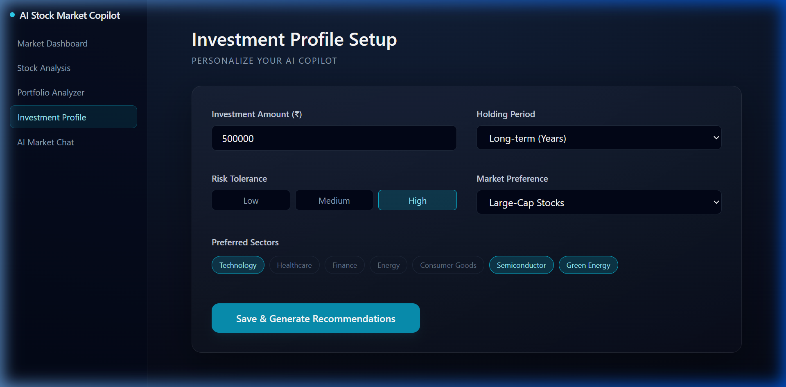
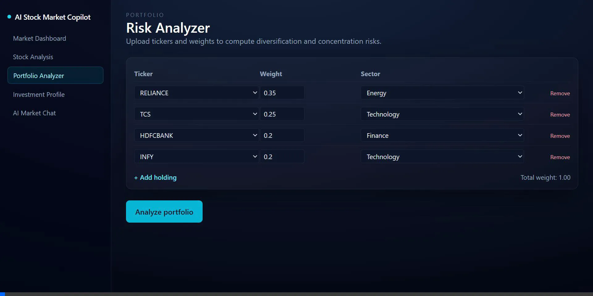
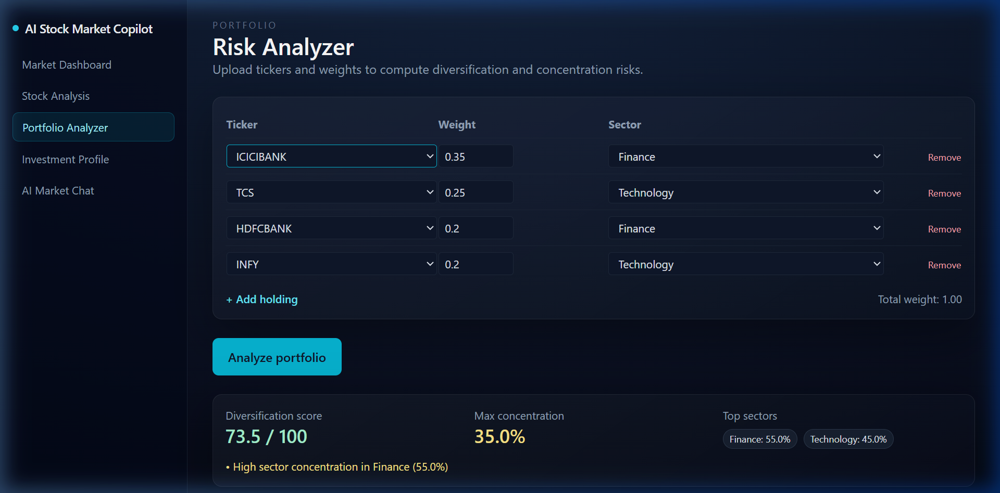
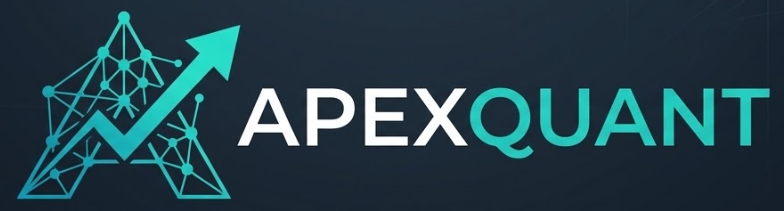
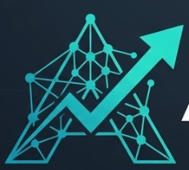
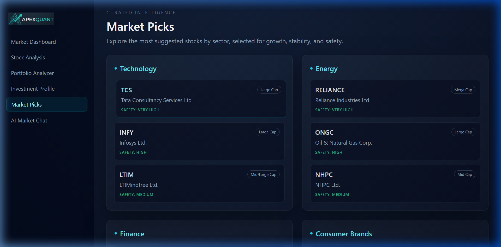

# ApexQuant: Visual Development Showcase

This document provides a visual timeline of the development process for ApexQuant, highlighting the UI evolution, new feature implementation, and automated UI verifications.

## 1. Initial State & Problem Identification
At the beginning, the application required significant refactoring to target the Indian market, fix AI integrations, and handle real-time data efficiently.

## 2. Investment Profile Integration
We introduced the personalized "**Investment Profile Setup**", allowing the AI Copilot to understand user constraints (Amount, Risk, Timeline) before making recommendations.

## 3. UI Simplification: Portfolio Analyzer
To bridge the gap between institutional tools and retail investors, we simplified complex quantitative terms (e.g., transforming "Max Concentration" into "Biggest Single Investment"). We also added automated sector mapping.

## 4. Rebranding to ApexQuant
We shifted the brand identity to **ApexQuant** to reflect its top-tier, data-driven nature, injecting new logos and favicons seamlessly into the dark-themed UI.

## 5. Market Picks & Interactive Deep Dive
The most significant addition was the **Market Picks** feature, categorizing top-rated stocks by sector and providing a deep-dive modal.

## 6. Final End-to-End Automated UI Verification
After resolving all AI quota mechanisms (the "Smart Fallback" engine) and testing the Live Data endpoints, an automated browser agent walked through the entire unified application.

